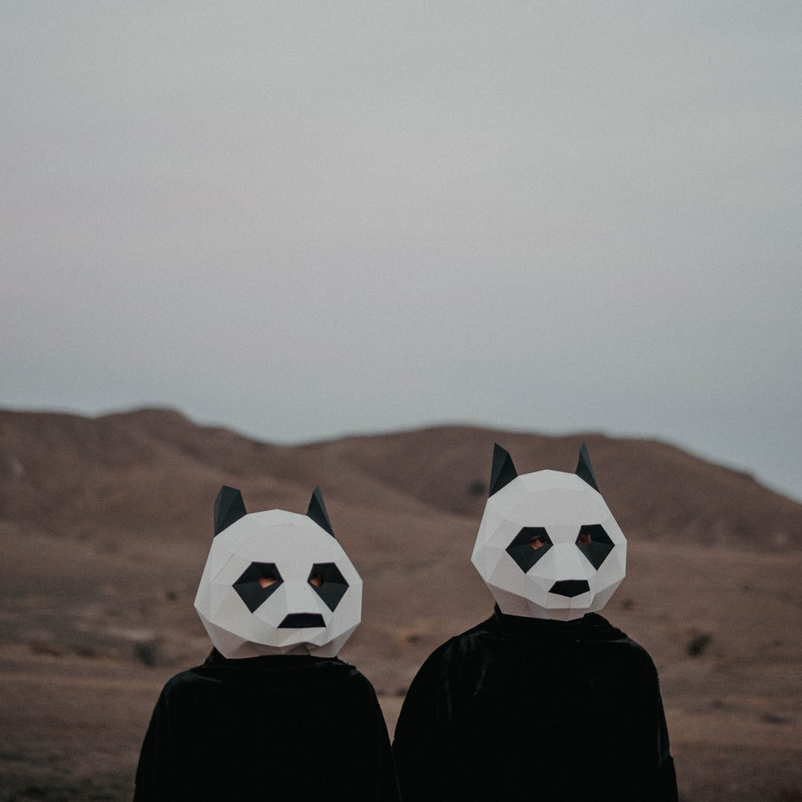

# Mosaica - A site to generate a mosaic of photos 

### Check it out at: [http://mosaica.netlify.com/](http://mosaica.netlify.com/) 
#### At the time the processing server is not live. You can check out the site (as it is hosted on netlify), but it won't generate a mosaic. You can run it locally however 😉.

### The idea

So I had a conversation with a friend about how cool the concept of generating mosaics from a set of photos is. And thus I began this project as a proof of concept of sorts, to see how difficult would it be to make a tool like that.

The basic idea is simple, I calculate the average rgb values of a certain area of the image (mask). Then those average values are sent to a node server and processed. The server tries for each average to find an image with its dominant color closest to that value. If the neighbor pixels are similar in color e.g. an with a blue sky background, it'll try to use different images to avoid repetetion. Then it compiles a new image populated by those pictures selected to better match that area and sends the result back to the front end. 

### I used

[gsap](https://www.npmjs.com/package/gsap) for animations and interpolate values passed to the shader.  
[react-three/fiber](https://docs.pmnd.rs/react-three-fiber/getting-started/introduction) for the shaders.  
[jimp](https://www.npmjs.com/package/jimp) to stich the final image together on the server.  
[rgb-lab](https://github.com/antimatter15/rgb-lab/blob/master/color.js) to convert rgb to lab values and comparing the difference between two labs

 

The original image         | The final mosaic generated
:-------------------------:|:----------------------------:
              |  

### Optimization

Instead of two for loops iterating the rows ans columns of the image, I use a single one because I think it reduces the time complexity.

The server needs to know the dominant color of each image to match them for the final mosaic. To reduce unnecessary image reads, which takes a lot of time, I had them pre-processed and stored all the necessary info to a json.

Another thing is that at some point, some images are gonna be used more than once at the mosaic, so again to reduce unnecessary image reads I cache every that I read so that the next time it'll be ready and won't have to be read again. 

### How to run it

First off clone the repo 

Run the python 2 script in the /server/assets folder

> This will produce an new folder with some small 200x200 images to fill the mosaic with and a json with all the necessery info. Tweak it as you like before execution as to the amount of the image to fetch or the colors.

Then `npm install` and `npm start` at the root and the server folder et voilà!

### Caveats and possible future changes

Right now the input image and as a result the output mosaic is limited to a square aspect ratio. Images with different ratio will default to a center crop. I would like to keep the maintain the ratio of the input image.

I would also like to have a way to inform the client about the estimated time for the mosaic to be done. I tried to use websockets to send back some kind of indication but it didn't work. My next thought was to keep a log file at the server side and keep track of the average times so that the client will have some vague idea about the eta.

### MIT License

MIT License

Copyright (c) 2022 John Roussos

Permission is hereby granted, free of charge, to any person obtaining a copy
of this software and associated documentation files (the "Software"), to deal
in the Software without restriction, including without limitation the rights
to use, copy, modify, merge, publish, distribute, sublicense, and/or sell
copies of the Software, and to permit persons to whom the Software is
furnished to do so, subject to the following conditions:

The above copyright notice and this permission notice shall be included in all
copies or substantial portions of the Software.

THE SOFTWARE IS PROVIDED "AS IS", WITHOUT WARRANTY OF ANY KIND, EXPRESS OR
IMPLIED, INCLUDING BUT NOT LIMITED TO THE WARRANTIES OF MERCHANTABILITY,
FITNESS FOR A PARTICULAR PURPOSE AND NONINFRINGEMENT. IN NO EVENT SHALL THE
AUTHORS OR COPYRIGHT HOLDERS BE LIABLE FOR ANY CLAIM, DAMAGES OR OTHER
LIABILITY, WHETHER IN AN ACTION OF CONTRACT, TORT OR OTHERWISE, ARISING FROM,
OUT OF OR IN CONNECTION WITH THE SOFTWARE OR THE USE OR OTHER DEALINGS IN THE
SOFTWARE.